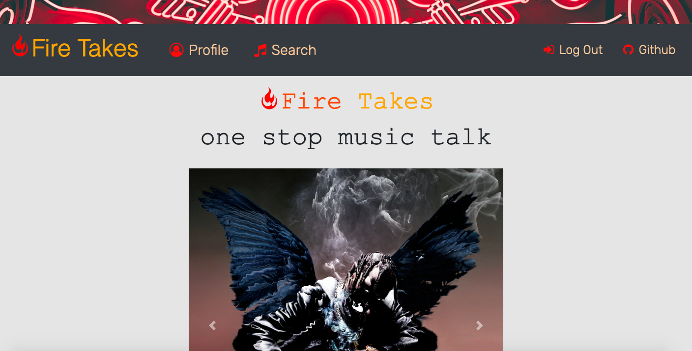
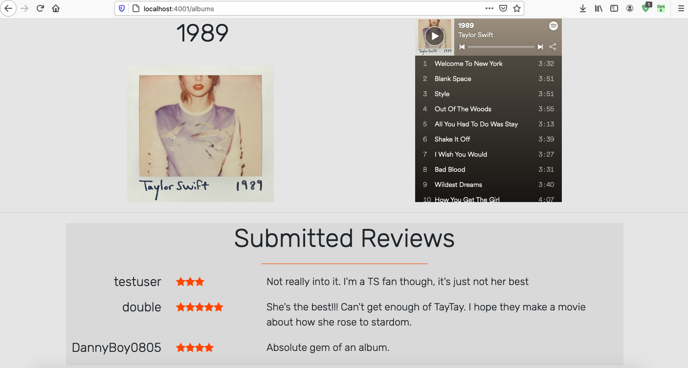
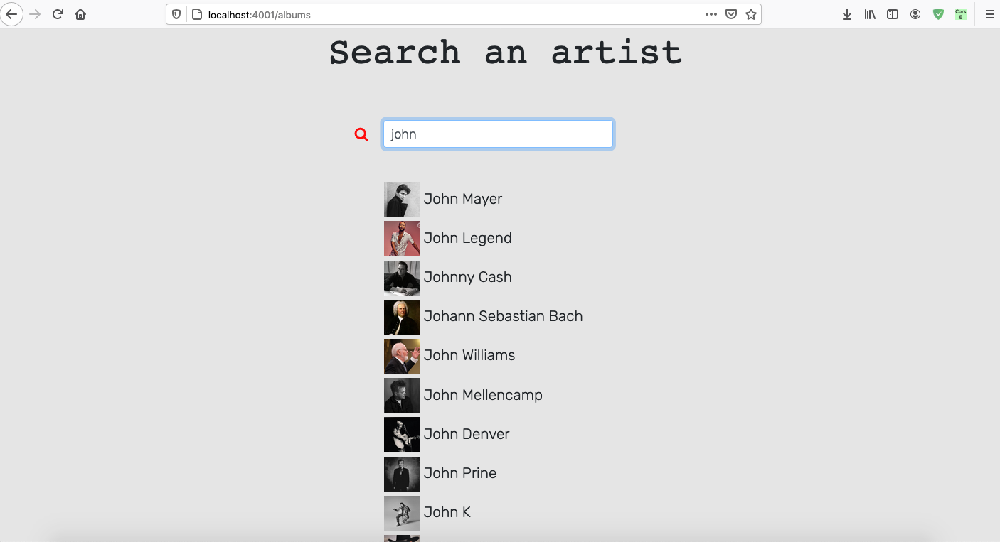
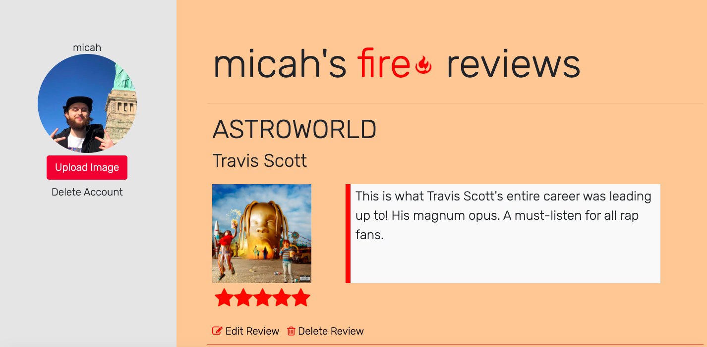

# Team Cannon Project

<h1>Fire Takes<h1>


<h1><u>Overview:</u><h1>
<h4>Fire Takes is the world's most popular album-review site, where users can share their opinions on today's hottest new releases and the greatest hits of yesterday. Users can search for albums to see current opinions, stream samples (or entire tracks, thanks to our partners over at Spotify), and add their own reviews. Registered users have a history of albums they have reviewed and are able to contribute to the growing conversation. </h4>

</br>





<h2><u>Meet Team Cannon!</u></h2>

<h3>Cainan Barboza</h3>
https://github.com/CainanB
<b>Role:</b> Lead back-end organization. API calls, database management, routing, and UI development.
</br>

<h3>Micah Peterson</h3>
https://github.com/petersonprojects
<b>Role:</b> Lead UI/UX development. HTML and CSS styling, animations, UI development, and functionality.
</br>

<h3>Dan Gelok</h3>
https://github.com/dgelok
<b>Role:</b> Project management and back-end support. Authentication, database setup and management, and design.


</br>
</br>
</br>

<h1><u>Tools used in the project:</u></h1>
<h3>Languages:</h3>
<ul>
    <li>HTML</li>
    <li>CSS</li>
    <li>JavaScript (via Node.js)</li>
    <li>SQL (via Sequelize)</li>
</ul>

<h3>Modules (for Node.js):</h3>
<ul>
    <li>Sequelize</li>
    <li>Express</li>
    <li>EJS</li>
    <li>bcrypt</li>
    <li>bcrypt-js</li>
    <li>body-parser</li>
    <li>cookie-parser</li>
    <li>multer</li>
    <li>pg</li>
    <li>pg-hstore</li>
</ul>

<h3>Other:</h3>
<ul>
    <li>Node.js</li>
    <li>Sequelize</li>
    <li>GIMP</li>
    <li>Postico</li>
    <li>Postman</li>
    <li>ElephantSQL</li>
</ul>

<h3>APIs</h3>
<ul>
    <li>Spotify API - https://developer.spotify.com/documentation/web-api/</li>
</ul

</br>

<h1><u>Base Objectives:</u></h1>
<ul>
    <li>Users are able to register unique usernames, and sign in and out</li>
    <li>Users are able to search for and access any album available via Spotify API</li>
    <li>Authentication required for submitting new reviews</li>
    <li>All reviews are stored in database and listed each time the corresponding album is searched</li>
    <li>All reviews made by a single user are displayed on profile page</li>
    <li>Navbar shifts between register/profile and login/logout, depending on status</li>
    <li>Team goals: increased communication, smoother version control, more independent development</li>
</ul>

</br>

<h3><u>Stretch Goals Completed:</u></h3>
<ul>
    <li>Users can upload a personal photo to their profile</li>
    <li>Users can listen to 30-second snippets of album tracks via Spotify API - or full tracks, if signed in through Spotify</li>
</ul>

</br>

<h3><u>Stretch Goals Future</u></h3>
<ul>
    <li>Create a cumulative average score from total user reviews</li>
    <li>Place user photo by user reviews on album page</li>
    <li>Enable 'follow' status for albums or artists, with alerts to new reviews</li>
    <li>Provide chat room</li>
    <li>Enable comment responses per review</li>
    <li>Place most recent reviews on landing page</li>
    <li>Place users with highest num of reviews on landing page</li>
</ul>

</br>

<h2><u>Challenges & Solutions:</u><h2>
<h3>Some of the biggest challenges we faced with this project build included:</h2>

<b>Challenge: Simultaneous DB/API calls</b>
<br>
<b>Solution: Refactoring code allowed us to store necessary API data in our database, making only a single call necessary, instead of an initial call to our database and then a followup call to the Spotify API.</b>

<b>Challenge: More advanced design (compared to earlier projects)</b>
<br>
<b>Solution: Additional CSS development provided animations, working with GIMP provided a unique logo, and a series of authentication checks changed </b>

<b>Challenge: Photo uploads</b>
<br>
<b>Solution: Research led us to Multer middleware, and documentation research provided the required solution.</b>

<b>Challenge: We got sick</b>
<br>
<b>Solution: Naps.</b>


</br>

<h1><u>Code Snippets:</u></h1>

<h4>This CSS snippet showcases custom-built hover animations for the navbar:</h4>

```
.nav-link:hover
{
    box-shadow:
        1px 1px rgb(255, 11, 11),
        2px 2px rgb(255, 11, 11),
        3px 3px rgb(255, 11, 11);

    -webkit-transform: translateX(-3px);
    transform: translateX(-3px);
    color: orange;
}

.custom-toggler.navbar-toggler {
    border-color: orange;
} 

.custom-toggler.navbar-toggler-icon {
    color: orange;
} 

.navbar-dark .custom-toggler .collapzoid:hover{
    color:pink;
}

.threed:hover{
    box-shadow:
        1px 1px rgb(255, 11, 11),
        2px 2px rgb(255, 11, 11),
        3px 3px rgb(255, 11, 11);

    -webkit-transform: translateX(-3px);
    transform: translateX(-3px);
}

```

</br>

<h4>This Jquery snippet is used to handle the registration of a new user:</h4>

```
$("#registerButton").click(async(e) => {
    e.preventDefault(); 
    let passw = $('#password').val()
    let passConf = $('#passwordConfirm').val()
    // console.log(passw)
    // console.log(passConf)

    if (passw != passConf) {
        $('#passwordFailMessage').show();
        $('#registerFailMessage').hide();
        // console.log(`${$('#password')}`)
        // $('#password').value = "";
        // $('#passwordConfirm').value = "";
    }
    else {
        fetch('/registration',{
            method: "POST",
            headers: {'Content-Type' : 'application/json'},
            body: JSON.stringify({
                username : $('#username').val(),
                password: $('#password').val()
                
            })
        })
        .then(results => results.json())
        .then(result => {
            // console.log(result) 
            if(result == "success"){
                $('#exampleModal').modal('toggle');
            }else{
                $('#registerFailMessage').show();
                $('#passwordFailMessage').hide();
            }
        })
    }
})
```
</br>
<h4>This snippet, found in our routes, handles a POST request and allows for the creation of a new review, thus enabling us to tether information from Spotify API into our database: </h4>

```
router.post('/albums', async (req, res) => {
    // let username = req.session.username;
    let userID = parseInt(req.session.userID)
    let review = req.body.reviewText
    if(req.body.rating == 'undefined' || req.body.rating == undefined)
    {
        req.body.rating = 5;
    }
    let rating =  parseInt(req.body.rating);
    let albumID = req.body.albumID
    let albumTitle = req.body.albumName;
    let aristName = req.body.artistName;
    let albumURL = req.body.albumArt;

  
    // console.log(`userID: ${userID}, review: ${review}, rating: ${rating}, albumID: ${albumID}`);

    db.reviews.create({
        authorID: userID,
        stars: rating,
        text: review,
        albumID: albumID,
        aristName: aristName,
        albumTitle: albumTitle,
        albumURL: albumURL

    })
    .then(user =>{
        // console.log("review inserted succesfully")
        res.redirect('/')
    })
    .catch(error =>{
        console.log(error)
    })
})
```
</br>
<h4>This JS snippet is used to fetch user review data from the database, then populate the profile page:</h4>

```
const getUserInfo = async () =>{
    $("#userReviewsBlock").html("")
    const reviews = await fetch('/userInfo')
    let userReviews = await reviews.json();
    userReviews.reverse();  // REVERSE THE RESULTS SO THE LATEST REVIEW MADE SHOWS FIRST
    userReviews.forEach((review,i)=>{ // LOOP THROUGH EACH REVIEW AND CREATE HTML ELEMENTS
        let starHTML = '';
        for(let i = 0; i < review.stars;i++)
        {
            starHTML += '<span class="one fa fa-star fa-2x checked"></span>'
        }
        let htmlEl = `
        <div id="${review.id}Container">
            <div class="row">
                <h1 class="ml-2"> ${review.albumTitle} </h1>
            </div>
            <div class="row ml-2">
                <h3> ${review.aristName} </h3>
            </div>
                <div class="row ml-2 mt-2">
                <div class="col-xl-3 mt-1 pl-0 pr-0">
                    <a href="/albums"></a>
                </div>
                <div class="col-xl-8 ml-xl-3 mt-1 pl-0 d-flex justify-content-start">
                    <blockquote id="${review.id}currentReviewText" class="lead blockquote text-left ml-0 mt-0 pt-1 h-100 w-100">
                        ${review.text}
                    </blockquote>
                </div>
            </div>
            <div id="stars" class="col-2 pt-1 mt-1  ml-0 d-flex justify-content-start">
                ${starHTML}
            </div>
            
            <a href="#" id="${review.id}" class="edit ml-2 mt-4" style="display:inline-block;"><i class="editReviewButton fa fa-pencil-square-o" aria-hidden="true"></i> Edit Review</a>
            <a href="#" id="${review.id}" class="delete edit ml-2 mt-4" style="display:inline-block;"><i class="deleteReviewButton fa fa-trash-o" aria-hidden="true"></i> Delete Review</a>
            <hr style="height: 1px;
            background-color: orangered;
            border: none;margin-top:0.5rem">
            </div>
        `
        $("#userReviewsBlock").append(htmlEl)

        // SAVE A UNIQUE REVIEW EDIT FORM FOR EACH REVIEW AND PUSH TO ARRAY
        reviewForms.push({
            id: review.id,
            html: `<form id="${review.id}form">
            <input id="${review.id}hiddenInput" type="hidden" name="albumID" value="${review.id}">
            <textarea id="${review.id}editedReviewText" name="editedReviewText">${review.text}</textarea>
            <input class="btn btn-danger editedReviewSubmitButton" type="submit" id="${review.id}">
            </form>`
        })
        
    });
}

```
</br>


<h2>Screenshots:</h2>

<h4>Login and user registration.</h4>
<br />

